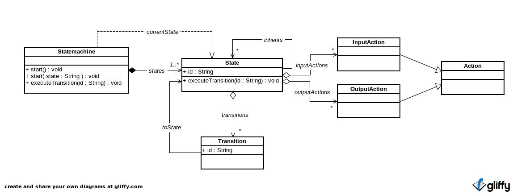

syo-state-machine
=================

Permite a criação de uma máquina de estados, com a adição de um conceito adicional: a herança.

O diagrama conceitual abaixo descreve a estrutura da máquina de estados:



Abaixo segue exemplo de uso:
```javascript
$( "#statemachine" ).statemachine({
    start: "stateA",
    states: [
        {
            id: "stateA",
            inputActions: [function() {
                alert( "A.in" );
            }],
            outputActions: [function() {
                alert( "A.out" );
            }],
            transitions: [{
                id: "transition1",
                toState: "stateB"
            }]
        },
        {
            id: "stateB",
            inputActions: [function() {
                alert( "B.in" );
            }],
            outputActions: [function() {
                alert( "B.out" );
            }],
            transitions: [{
                id: "transition2",
                toState: "stateA"
            }]
        }
    ]
});

$( "#statemchine" ).start();
$( "#statemchine" ).statemachine( "executeTransition", "transition1" );
$( "#statemchine" ).statemachine( "executeTransition", "transition1" );
```
